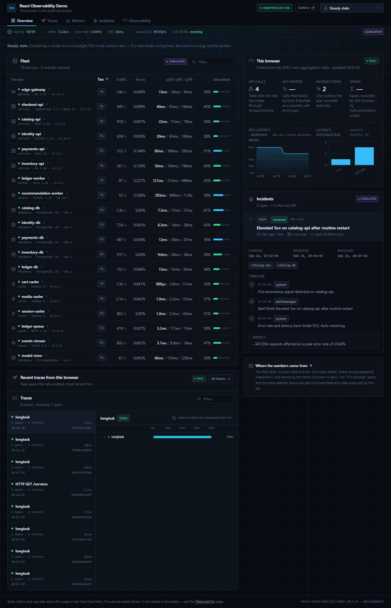

# React Observability Demo

A React dashboard that instruments itself with real OpenTelemetry and then visualises the result.
The browser is the observed system: this app emits genuine OTLP spans, metrics and logs about
**its own** page loads, fetches, clicks and rendering performance, exports them to an OpenTelemetry
backend, and reads them back into its own UI.



---

## Read this first: what is real and what is not

This project contains two completely different kinds of data, and it would be easy to write a
README that lets you blur them together. So, plainly:

| | Real | Simulated |
|---|---|---|
| **What** | Telemetry about **this browser tab** | A fictional microservice estate |
| **Source** | The OpenTelemetry SDK, running in your page | `simulator/`, generated from a seeded PRNG |
| **Signals** | Traces, metrics, logs, exported over OTLP/HTTP | Service health, incidents, latency series served as JSON |
| **Where it goes** | The configured OTLP endpoint → an OpenTelemetry Collector → Tempo / Prometheus / Loki | Nowhere. It is generated on request by the Vercel functions in `api/` |
| **In the UI** | Green **`real`** tag | Blue **`simulated`** tag |

**The telemetry is simulated.** There is no production system behind this dashboard. The service
fleet, its latency percentiles, its error budgets and its incidents are fabricated by
`simulator/engine.ts`. Nothing is scraped, nothing is measured, and no real request is ever served
by any of the nineteen services in the fleet table.

**What is genuinely real** is the instrumentation. `@opentelemetry/sdk-trace-web`,
`@opentelemetry/sdk-metrics`, `@opentelemetry/sdk-logs` and the OTLP HTTP exporters are all in
`package.json` and all doing real work. Open DevTools, click something, and watch a real
`POST /v1/traces` leave your browser. Those spans have real trace ids and real durations, and they
land in a real collector.

Every panel that displays data is tagged with its provenance on screen, not just here. If you ever
cannot tell which kind of data you are looking at, that is a bug — please open an issue.

### On the acronym

The conventional expansion of "LGTM" is **L**oki, **G**rafana, **T**empo, **M**imir. The
[`grafana/otel-lgtm`](https://github.com/grafana/docker-otel-lgtm) image used here bundles **Prometheus**,
not Mimir. So this README says **Prometheus** everywhere. The acronym is not a claim about which
backend is running, and calling it "Mimir" because it fits the letters would be a lie about the
stack.

Actually running in that container:

| Component | Role |
|---|---|
| OpenTelemetry Collector | Receives OTLP on `4317` (gRPC) and `4318` (HTTP) |
| **Prometheus** | Metrics |
| Tempo | Traces |
| Loki | Logs |
| Pyroscope | Profiles |
| Grafana | The UI, on `3000` |

---

## Quickstart

Requires Node ≥ 22.12 and Docker.

```bash
git clone https://github.com/PXINXYZ/react-observability-demo.git
cd react-observability-demo
npm install

docker compose up -d      # the OpenTelemetry backend
npm run dev               # the app
```

Open <http://localhost:5173>, click around, then open <http://localhost:3000> and log in with
`admin` / `admin`. Explore → Tempo → Search, and filter by `service.name = react-observability-demo`.

No `.env` file is needed — the defaults point at `http://localhost:4318`.

### No Docker?

Docker needs virtualisation enabled in your firmware. If you cannot run it, you can still verify
that the export pipeline genuinely works, because the app exports standard OTLP and you can point it
at anything that speaks it:

```bash
node tools/otlp-sink.mjs      # a dependency-free OTLP/HTTP receiver that prints what it gets
npm run dev
```

You will see real span names, trace ids, attributes and metric data points scroll past. That proves
the instrumentation and the wire format; what you lose is Grafana itself.

---

## What the app does

Five routes, each labelled with the provenance of what it shows:

- **Overview** — the simulated fleet (19 services, health, latency percentiles, saturation, error
  budgets), the real instruments this tab has recorded, a simulated incident feed, and a live trace
  waterfall of spans this browser just emitted.
- **Traces** — two tabs, one dedicated to *real* spans teed out of the OTel SDK, one to *simulated*
  traces. Identical rendering, different data source, and the difference is stated on the page.
- **Metrics** — real instruments read out of the SDK's own aggregation state, real Core Web Vitals,
  a raw instrument explorer, and the fabricated Prometheus-style estate series.
- **Incidents** — the fabricated incident feed with timelines and severity laddering.
- **Observability** — the page that has to be checkable: resolved configuration, export-pipeline
  health, an explicit force-flush button, the live log stream, and copy-pasteable Grafana queries.

There is one write action: the scenario picker in the header. Choosing a scenario POSTs to
`/api/simulate` and swaps the whole simulated estate atomically.

---

## How the instrumentation works

Everything lives in `src/observability/`. It is the part of this repo worth reading.

### The browser really is the observed system

`initObservability()` runs in `src/main.tsx` **before** React mounts, so the first paint is already
observed. It sets up three real SDK providers and four automatic instrumentations:

| Instrumentation | What it produces |
|---|---|
| `document-load` | `documentLoad`, `documentFetch`, `resourceFetch` spans with real navigation timing |
| `fetch` | a span per HTTP request, nested correctly under the app's own span |
| `user-interaction` | a span per click and submit |
| `long-task` | a span whenever the main thread blocks long enough to hurt INP |

On top of that, `src/api/client.ts` adds a named span for every backend call, and
`src/observability/webVitals.ts` records real LCP / INP / CLS / TTFB / FCP as OTel histograms.

### Reading telemetry back out

Two small pieces make the "read it back into a UI" half work, and both are worth calling out because
neither is a stock SDK feature:

- **`spanStore.ts`** implements a `SpanProcessor` that tees every ended span into a bounded ring
  buffer. The spans the waterfall renders are the same `ReadableSpan` objects the exporter sends —
  not a fixture, not a re-fetch. Click a button and a real span appears.
- **`metricStore.ts`** implements a `MetricReader` that pulls the SDK's aggregation state into the
  UI on a timer. The SDK used to ship `InMemoryMetricReader` for exactly this; it is gone in the 2.x
  line, so this is a ~40-line replacement.

Because the UI reader and the OTLP exporter are both registered against the same `MeterProvider`,
the numbers on screen and the numbers in Prometheus come from the same instruments and the same
recordings. Only the destination differs.

### `exportStats.ts`

Browser OTel fails silently by default: a wrong URL, a stopped collector or a CORS rejection all
look identical to a working app, because exporter errors go to diagnostics and nowhere else. This
module wraps each exporter in a `Proxy` that records every batch attempt, success or failure, and
surfaces it in the UI. It is the difference between "we send telemetry" and "we can show you it
arrived".

---

## Deliberate tradeoffs

These are choices, not oversights. They are listed here so you can disagree with them.

**No zone.js.** The default `StackContextManager` is used rather than `ZoneContextManager`. zone.js
would propagate context across `await` boundaries, but it patches `Promise`, timers and every event
target in the page — a heavy, invasive dependency. Instead, `withSpan` invokes `fetch` before its
first `await`, so the fetch instrumentation always sees the active span and nests correctly. You can
see this working in the verification output below, where the instrumentation's `GET` span carries an
explicit `parent=` pointing at the app's own span. The cost is that context does not survive a stray
`await` mid-span.

**Scenario state lives in the browser.** An earlier design kept "the active scenario" in module scope
on the server. That works on a warm serverless instance and silently resets on a cold one, which is
the worst possible bug class for a demo. The client now owns the selection and passes `?scenario=` to
every endpoint.

**The serverless functions are not instrumented.** Short-lived functions flush spans unreliably, and
the point of this project is observing the browser. Instrumenting them would add noise and undermine
the claim rather than support it.

**Recharts is a third of the bundle.** `charts` is ~387 kB raw / ~111 kB gzipped of a ~1.08 MB /
~325 kB gzipped total. That is a lot for four chart types, and hand-rolled SVG would be leaner. It is
kept because it is a legitimate, widely-used library whose import is visible in `package.json`.

**The dev-server trace is huge.** Vite serves every module separately, so `document-load` produces a
resource span per module in development. In a production build the same trace is a handful of spans.

---

## Verify it yourself

Every claim above is checkable. The app ships the queries on its Observability page.

**Traces — Grafana → Explore → Tempo**

```
{ resource.service.name = "react-observability-demo" }
```

You should see `documentLoad`, `HTTP GET /api/services`, `scenario.switch`, `click` and `longtask`
spans, each with a real trace id, and the app's own spans containing the instrumentation's spans as
children.

**Metrics — Grafana → Explore → Prometheus**

```
app_api_client_duration_milliseconds_count
app_api_client_requests_total
browser_web_vitals_lcp_milliseconds_bucket
app_telemetry_spans_buffered
```

**Logs — Grafana → Explore → Loki**

```
{ service_name = "react-observability-demo" }
```

Every API call and scenario switch emits a record. Records emitted inside a span carry that span's
trace id, so you can jump from a log line to its trace.

### What was verified, and how

The instrumentation was verified end-to-end against a real OTLP receiver, not assumed:

```
✓ documentLoad                    67.0ms   react-observability-demo  via @opentelemetry/instrumentation-document-load
  trace=23f625f9ce97a9fbb52622d1cac1e8ba span=6d43438301a62f22 (root)
✓ HTTP GET /services             185.0ms   react-observability-demo  via react-observability-demo
  trace=f90b3506aecb96f20ef1d0efc4901cc1 span=d4effd6184b4eec2 (root)
  app.api.boundary=src/api/client.ts  app.api.route=/services  http.response.status_code=200
✓ GET                            158.0ms   react-observability-demo  via @opentelemetry/instrumentation-fetch
  trace=f90b3506aecb96f20ef1d0efc4901cc1 span=1ea0758a1f3e44a4 parent=d4effd6184b4eec2   ← nested correctly
✓ app.api.client.duration        histogram n=3 mean=152.00
✓ app.ui.interactions            sum value=2
✓ app.telemetry.spans_buffered   gauge value=103
✓ browser.web_vitals.fcp         histogram n=1 mean=208.00
DEBUG API GET /services ok in 1.6ms  react-observability-demo
```

This confirms: real OTLP/HTTP to the correct signal paths, correct parent/child span nesting across
the instrumentation boundary, custom instruments recording and exporting, and logs carrying trace
context.

**Not verified by the author:** Grafana rendering the data, because the machine this was built on has
virtualisation disabled in firmware and cannot start Docker at all (`WSL2 is unable to start since
virtualisation is not enabled on this machine`). The collector-side path is the part that was
exercised; the Grafana-side path is standard `otel-lgtm` behaviour and is what `docker compose up -d`
gives you. Treat it as documented-but-unverified-here rather than as a claim.

---

## Repository layout

```
observability/          ← src/observability/ — the real OTel wiring
  config.ts               env resolution, signal URL construction
  tracing.ts              WebTracerProvider, instrumentations, withSpan
  metrics.ts              MeterProvider, app instruments, observable gauge
  logger.ts               LoggerProvider, tees records into a UI ring buffer
  spanStore.ts            SpanProcessor → bounded ring buffer (real spans in the UI)
  metricStore.ts          MetricReader → UI snapshots (replaces InMemoryMetricReader)
  exportStats.ts          export health, visible in the UI
  webVitals.ts            real Core Web Vitals as OTel histograms
  types.ts                view models shared by real and simulated data

api/client.ts           ← src/api/client.ts — the single backend boundary
hooks/                  ← src/hooks/ — TanStack Query wrappers + store subscriptions
  useServices.ts  useTelemetry.ts  useIncidents.ts  useDebounce.ts  useTelemetryStore.ts
components/
  ServiceTable.tsx  MetricsPanel.tsx  IncidentFeed.tsx  TraceViewer.tsx

simulator/              Fabricated estate. Shared types, not a service. No I/O, no state.
  types.ts  catalog.ts  scenarios.ts  engine.ts  random.ts

api/                    Vercel functions serving the simulator
  services.ts  metrics.ts  traces.ts  incidents.ts  simulate.ts
  _lib/http.ts            Node-native request/response helpers

tools/otlp-sink.mjs     Dependency-free OTLP receiver, for when Docker is unavailable
```

`simulator/` sits at the repository root because it is shared by two consumers that must agree
exactly: the Vercel functions that serve it, and the React app, which imports its **types** so the
client boundary is typed against the same contract the server implements.

---

## Environment variables

One variable is the whole integration. Everything else has a sane default.

| Variable | Default | Purpose |
|---|---|---|
| `VITE_OTLP_ENDPOINT` | *(empty)* | Base OTLP/HTTP endpoint. Empty disables export; the app still runs and says so. |
| `VITE_OTLP_HEADERS` | *(empty)* | `key=value,key2=value2` sent as OTLP headers. Required for Grafana Cloud. |
| `VITE_SERVICE_NAME` | `react-observability-demo` | `service.name` resource attribute. |
| `VITE_SERVICE_VERSION` | `0.1.0` | `service.version`. |
| `VITE_DEPLOYMENT_ENVIRONMENT` | Vite mode | `deployment.environment.name`. |
| `VITE_TRACES_SAMPLE_RATE` | `1` | Head sampling ratio, 0–1. |
| `VITE_METRIC_EXPORT_INTERVAL` | `10000` | Metric export interval, ms. |
| `VITE_GRAFANA_URL` | *(empty)* | Adds an "Open in Grafana" link in the header. |

See `.env.example`.

> **Security note.** Anything in a `VITE_*` variable is compiled into the browser bundle and readable
> by anyone who loads the page. Use a write-only, ingest-scoped token for `VITE_OTLP_HEADERS` and
> nothing else. This is why the hosted demo runs with export disabled unless a disposable token is
> supplied.

---

## Deployment

**Vercel** hosts the SPA and the serverless simulator functions. **LGTM is not on Vercel** — it is
supplied at runtime, either by `docker-compose.yml` for local use or by a Grafana Cloud gateway URL
for a hosted demo. There are no containers in the Vercel deployment.

To point a deployment at Grafana Cloud:

```env
VITE_OTLP_ENDPOINT=https://otlp-gateway-<zone>.grafana.net/otlp
VITE_OTLP_HEADERS=Authorization=Basic <base64(instanceId:token)>
VITE_GRAFANA_URL=https://<your-stack>.grafana.net
```

Set these in the Vercel project, redeploy, and the same code exports there instead. Nothing else
changes.

The Vercel functions are written against plain Node `IncomingMessage` / `ServerResponse`, which is
the one signature that works unchanged in both runtimes this project runs in: the Vercel Node
runtime in production, and the Vite dev-server middleware in `vite.config.ts` during development.
That is what makes a fresh clone work with `npm run dev` and no `vercel dev`, no account, and no
network.

---

## Commands

```bash
npm run dev          # Vite dev server + the api/ functions, on :5173
npm run build        # tsc --noEmit && vite build
npm run typecheck    # tsc --noEmit
npm run preview      # serve the production build
npm run lgtm:up      # docker compose up -d
npm run lgtm:down    # docker compose down
node tools/otlp-sink.mjs   # OTLP receiver without Docker
```

## Stack

React 19.3 · Vite 8.3 · TypeScript 5.9 · Tailwind CSS 4.3 · TanStack Query 5 ·
OpenTelemetry JS SDK 2.11 / exporters 0.222 · Radix UI · lucide-react · Recharts · web-vitals

## Licence

MIT
