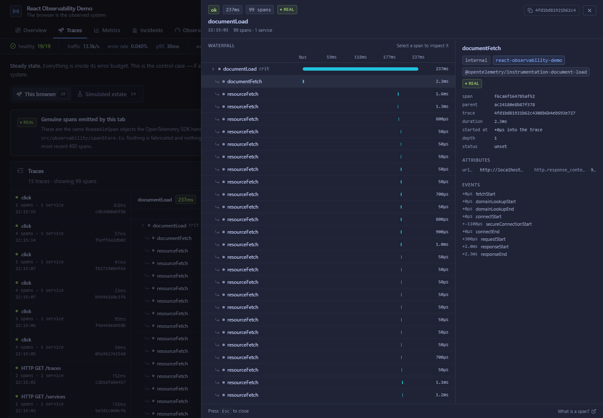
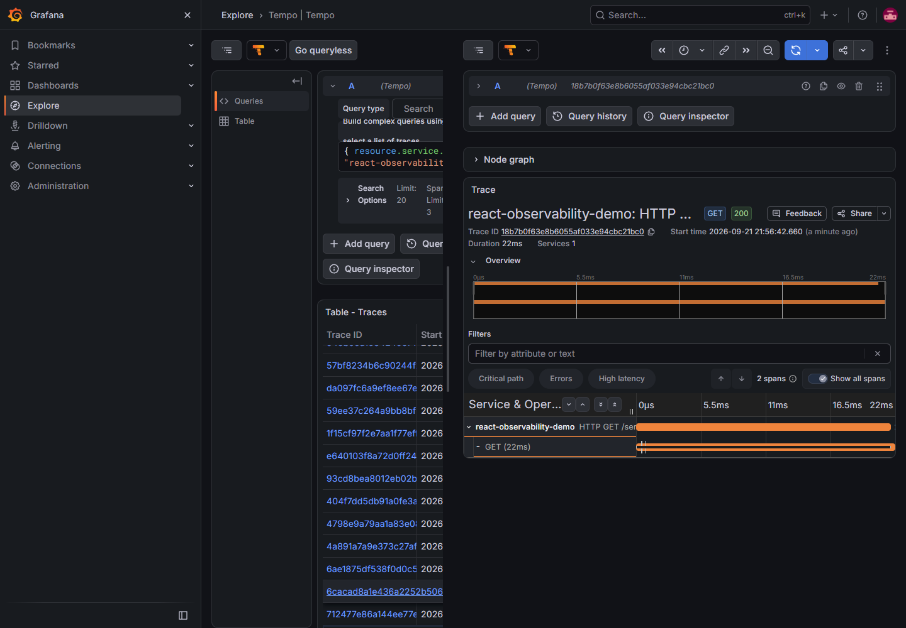

# React Observability Demo

**A React dashboard that instruments itself with real OpenTelemetry, exports that telemetry to a
real OTel backend, and then reads it back into its own UI.**

The browser is the observed system. Click a row, and a genuine span for that click appears in the
trace waterfall — real trace id, real duration, exported over OTLP/HTTP to a Grafana-Tempo-Prometheus-Loki
stack and then queried back out of it.

[](https://react-observability-demo.vercel.app)

**Live demo → <https://react-observability-demo.vercel.app>**
*(export is switched off there — see [what's real](#whats-real-and-what-isnt) and the note in the app's own header)*

---

## At a glance

| | |
|---|---|
| **What it is** | A production-shaped observability UI, plus the instrumentation that feeds it |
| **The interesting part** | The telemetry is real. React 19 emits OTLP spans, metrics and logs about itself |
| **Stack** | React 19 · TypeScript · Vite · Tailwind CSS 4 · TanStack Query · OpenTelemetry JS 2.x · Radix UI |
| **Runs on** | Vercel (SPA + serverless simulator) · any OTel backend (local LGTM, or Grafana Cloud) |
| **Size** | ~8,000 lines of TypeScript across 54 files, no test suite yet |
| **Try it** | `git clone` → `npm install` → `cp .env.example .env` → `docker compose up -d` → `npm run dev` |

**What this demonstrates.** Instrumenting a browser application properly — not just adding a tracking
snippet, but wiring the OTel SDK end to end, choosing where context propagates and where it cannot,
teeing real spans into a UI, and then being honest about which numbers are measured and which are
generated. The UI work is React 19 with `useSyncExternalStore`, TanStack Query for server state, and
Radix primitives for accessibility.

---

## What's real and what isn't

This project contains two completely different kinds of data, and it would be easy to write a README
that lets you blur them together. So, plainly:

| | Real | Simulated |
|---|---|---|
| **What** | Telemetry about **this browser tab** | A fictional microservice estate |
| **Source** | The OpenTelemetry SDK, running in your page | `simulator/`, generated from a seeded PRNG |
| **Signals** | Traces, metrics, logs, exported over OTLP/HTTP | Service health, incidents, latency series served as JSON |
| **Goes where** | OTLP endpoint → Collector → Tempo / Prometheus / Loki | Nowhere. Generated per request by the Vercel functions |
| **In the UI** | Green **`real`** tag | Blue **`simulated`** tag |

**The telemetry is simulated.** There is no production system behind this dashboard. The service
fleet, its latency percentiles, its error budgets and its incidents are fabricated by
`simulator/engine.ts`. Nothing is scraped and nothing is measured.

**What is genuinely real is the instrumentation.** `@opentelemetry/sdk-trace-web`, `sdk-metrics`,
`sdk-logs` and the OTLP HTTP exporters are all doing real work. Open DevTools, click something, and
watch a real `POST /v1/traces` leave your browser. Those spans have real trace ids and real durations.

Every panel is tagged with its provenance **on screen**, not just here. If you ever can't tell which
kind of data you're looking at, that's a bug — please open an issue.

### On the acronym

"LGTM" conventionally expands to **L**oki, **G**rafana, **T**empo, **M**imir. The
[`grafana/otel-lgtm`](https://github.com/grafana/docker-otel-lgtm) image used here bundles
**Prometheus**, not Mimir. So this README says **Prometheus** everywhere. The acronym is not a claim
about which backend is running.

---

## Quick start

Requires Node ≥ 22.12 and Docker.

```bash
git clone https://github.com/PXINXYZ/react-observability-demo.git
cd react-observability-demo
npm install

cp .env.example .env      # sets VITE_OTLP_ENDPOINT=http://localhost:4318
docker compose up -d      # the OpenTelemetry backend
npm run dev               # the app
```

Open <http://localhost:5173>, click around, then open <http://localhost:3000> (Grafana, `admin` /
`admin`) and go to **Explore → Tempo**:

```
{ resource.service.name = "react-observability-demo" }
```

The `cp` is not optional if you want anything in Grafana. `VITE_OTLP_ENDPOINT` has no built-in
default: an unset endpoint means no exporters are constructed, and the app says so in its header
rather than pretending. That's deliberate — a browser bundle that silently ships to `localhost` in
production would be worse than one that ships nowhere.

### No Docker?

Docker needs virtualisation enabled in your firmware. If you can't run it there are two fallbacks:

```bash
node tools/otlp-sink.mjs      # a dependency-free OTLP receiver that prints what it gets
```

You'll see real span names, trace ids, attributes and metric data points scroll past. That proves the
instrumentation and the wire format; what you lose is Grafana itself.

For the full stack without Docker, `tools/native-stack/` downloads the same five components as bare
Windows binaries into a throwaway directory, runs them, and can be deleted afterwards. This is how
the Grafana results below were verified on a machine where Docker cannot start at all.

---

## What you'll see

Five routes, each labelled with the provenance of what it shows:

- **Overview** — the simulated fleet, real instruments this tab recorded, a simulated incident feed,
  and a live waterfall of spans this browser just emitted
- **Traces** — real spans from the OTel SDK in one tab, simulated estate traces in the other.
  Same rendering, different data source, and the difference is stated on the page
- **Metrics** — real instruments read out of the SDK's own aggregation state, real Core Web Vitals, a
  raw instrument explorer, and the fabricated estate series
- **Incidents** — the fabricated feed with timelines and severity laddering
- **Observability** — the page that has to be checkable: resolved config, export-pipeline health, a
  force-flush button, the live log stream, and copy-pasteable Grafana queries

### The trace drill-down

Three steps, increasing in cost: a **list** to scan, an **inline waterfall** to see one trace's shape
in place, and a **drawer** to inspect a single span without losing your page.

[](docs/screenshot-trace-drawer.png)

That trace is 99 genuine spans the browser emitted for one page load — `documentLoad` →
`documentFetch` → 97 concurrent `resourceFetch` children. Only two are marked **crit**: only those
two determined how long the load took, while the 97 concurrent fetches ran underneath and never
extended the critical path. Selecting a span shows its ids, parent, timing, attributes and events,
including the real navigation timeline (`fetchStart` → `secureConnectionStart` → `requestStart` →
`responseStart` → `responseEnd`).

Because real spans stream in continuously, the list has a **Live / Paused** control and opening a
trace freezes it automatically — otherwise rows re-sort every second and move out from under your
cursor.

---

## How it works

Everything lives in `src/observability/`. It's the part of this repo worth reading.

### The browser really is the observed system

`initObservability()` runs in `src/main.tsx` **before** React mounts, so the first paint is already
observed. It sets up three real SDK providers and four automatic instrumentations:

| Instrumentation | What it produces |
|---|---|
| `document-load` | `documentLoad`, `documentFetch`, `resourceFetch` spans with real navigation timing |
| `fetch` | a span per HTTP request, nested under the app's own span |
| `user-interaction` | a span per click and submit |
| `long-task` | a span whenever the main thread blocks long enough to hurt INP |

On top of that, `src/api/client.ts` adds a named span for every backend call, and
`src/observability/webVitals.ts` records real LCP / INP / CLS / TTFB / FCP as OTel histograms.

### Reading telemetry back out

Two small pieces make the "read it back into a UI" half work, and neither is a stock SDK feature:

- **`spanStore.ts`** — a `SpanProcessor` that tees every ended span into a bounded ring buffer. The
  spans the waterfall renders are the same `ReadableSpan` objects the exporter sends. Not a fixture,
  not a re-fetch.
- **`metricStore.ts`** — a `MetricReader` that pulls the SDK's aggregation state into the UI on a
  timer. The SDK used to ship `InMemoryMetricReader` for this; it's gone in the 2.x line, so this is
  a ~40-line replacement.

Because the UI reader and the OTLP exporter are both registered against the same `MeterProvider`, the
numbers on screen and the numbers in Prometheus come from the same instruments and the same
recordings. Only the destination differs.

### Why browser OTel needs `exportStats.ts`

Browser OTel fails silently by default. A wrong URL, a stopped collector and a CORS rejection all look
identical to a working app, because exporter errors go to diagnostics and nowhere else. This module
wraps each exporter in a `Proxy` that records every batch attempt, success or failure, and surfaces it
in the UI. It's the difference between "we send telemetry" and "we can show you it arrived".

---

## Project structure

```
src/
  observability/        the real OTel wiring — start here
    config.ts             env resolution, OTLP signal URL construction
    tracing.ts            WebTracerProvider, instrumentations, withSpan
    metrics.ts            MeterProvider, app instruments, observable gauge
    logger.ts             LoggerProvider, tees records into a UI ring buffer
    spanStore.ts          SpanProcessor → ring buffer (real spans in the UI)
    metricStore.ts        MetricReader → UI snapshots
    exportStats.ts        export health, visible in the UI
    webVitals.ts          real Core Web Vitals as OTel histograms

  api/client.ts         the single backend boundary — every fetch goes through it
  hooks/                TanStack Query wrappers + useSyncExternalStore subscriptions
  components/           ServiceTable · MetricsPanel · IncidentFeed · TraceViewer
    trace/                the shared waterfall, span detail panel and drawer
  pages/                one file per route

api/                    Vercel functions serving the simulator
  _lib/http.ts            Node-native request/response helpers

simulator/              fabricated estate. Shared types, not a service. No I/O, no state.
tools/
  otlp-sink.mjs           dependency-free OTLP receiver, for when Docker is unavailable
  native-stack/           run the LGTM stack as bare binaries
```

`simulator/` sits at the repo root because it's shared by two consumers that must agree exactly: the
Vercel functions that serve it, and the React app, which imports its **types** so the client boundary
is typed against the same contract the server implements.

---

## Contributing

Issues and PRs are welcome. A few things that will make a PR easy to land:

**Before you start.** `npm run typecheck` and `npm run build` must both pass — CI-equivalent checks,
both run by `npm run build`. There is no test suite; verification here is typecheck, build, and
looking at the app.

**The one rule that matters.** Keep the real/simulated distinction honest. If a change makes a
fabricated number look measured, or labels real telemetry as fake, it will be rejected regardless of
how good it looks. Every panel carries a provenance tag and that has to stay true.

**Adding a scenario to the simulator.** Add an object to `simulator/scenarios.ts`. The engine applies
`perService` overrides over `global` over the catalog baselines and knows nothing about specific
scenarios, so no engine change should be needed.

**Adding a service to the fleet.** Add an entry to `simulator/catalog.ts` with its baseline profile.
The derived counts in the UI update themselves; only prose that names a specific number would need a
look.

**Changing the design system.** All colour and type tokens live in the `@theme` block of
`src/index.css` — change them there, not inline in components. Two constraints are load-bearing:
every text tier clears WCAG AA (4.5:1), and the semantic green/amber/red are **reserved for health
status**. There's a separate categorical `--color-series-*` palette for chart and span colours, so a
span bar can never be mistaken for a health state.

**Useful things to know.**

- Never use the semantic colours for anything but state
- Numbers go through `.tnum` for tabular figures, so columns don't jitter as values update
- `api/` and `simulator/` imports need explicit `.js` extensions — see below
- Read `AGENTS.md`-style conventions are not used here; the code comments carry the reasoning

**Good first contributions.** Point the demo at a Grafana Cloud stack and document it. Add a
scenario. Improve the mobile layout of the waterfall. Add a real test suite — that would be genuinely
valuable and doesn't exist yet.

---

## Environment variables

One variable is the whole integration. Everything else has a sane default.

| Variable | Default | Purpose |
|---|---|---|
| `VITE_OTLP_ENDPOINT` | *(empty)* | Base OTLP/HTTP endpoint. Empty disables export; the app says so. |
| `VITE_OTLP_HEADERS` | *(empty)* | `key=value,key2=value2` sent as OTLP headers. Required for Grafana Cloud. |
| `VITE_SERVICE_NAME` | `react-observability-demo` | `service.name` resource attribute. |
| `VITE_SERVICE_VERSION` | from `package.json` | `service.version`. Injected at build time — setting it pins a literal that will go stale. |
| `VITE_DEPLOYMENT_ENVIRONMENT` | Vite mode | `deployment.environment.name`. |
| `VITE_TRACES_SAMPLE_RATE` | `1` | Head sampling ratio, 0–1. |
| `VITE_METRIC_EXPORT_INTERVAL` | `10000` | Metric export interval, ms. |
| `VITE_GRAFANA_URL` | *(empty)* | Adds an "Open in Grafana" link in the header. |

> **Security note.** Anything in a `VITE_*` variable is compiled into the browser bundle and readable
> by anyone who loads the page. Use a write-only, ingest-scoped token for `VITE_OTLP_HEADERS` and
> nothing else. This is why the hosted demo runs with export disabled.

---

## Deployment

**Vercel** hosts the SPA and the serverless simulator functions. **LGTM is not on Vercel** — it's
supplied at runtime, either by `docker-compose.yml` or by a Grafana Cloud gateway URL. There are no
containers in the Vercel deployment.

To export from a deployment:

```env
VITE_OTLP_ENDPOINT=https://otlp-gateway-<zone>.grafana.net/otlp
VITE_OTLP_HEADERS=Authorization=Basic <base64(instanceId:token)>
VITE_GRAFANA_URL=https://<your-stack>.grafana.net
```

Set these in the Vercel project and redeploy. Nothing else changes.

### Two things that only fail on Vercel

Both cost real debugging time and neither reproduces locally, so they're written down.

**Vercel does not bundle serverless functions.** It transpiles each `api/*.ts` individually —
stripping types but leaving the ESM syntax alone — and Node then resolves the module graph at
runtime. Under ESM every relative specifier must name a real file *with its extension*, so
`from '../simulator'` fails with `ERR_UNSUPPORTED_DIR_IMPORT`. All specifiers in `api/` and
`simulator/` therefore carry explicit paths, and `tools/esm-specifiers.mjs` is the codemod that
applied it. Note that removing `"type": "module"` to force CommonJS does **not** work — the emitted
file still contains `import` statements.

**`vercel deploy` uploads `.env` regardless of `.gitignore`.** The CLI reads dotenv files from the
working directory and injects them as build-time variables, which once baked
`VITE_OTLP_ENDPOINT=http://localhost:4318` into production — so every visitor's browser tried to
export telemetry to its own machine. `.vercelignore` excludes dotenv files for exactly this reason.

---

## Verification

Claims in this README were checked by running them, not by assuming.

**The instrumentation was verified against a real OTLP receiver:**

```
✓ documentLoad                    67.0ms   via @opentelemetry/instrumentation-document-load
  trace=23f625f9ce97a9fbb52622d1cac1e8ba span=6d43438301a62f22 (root)
✓ HTTP GET /services             185.0ms   via react-observability-demo
  app.api.route=/services  http.response.status_code=200
✓ GET                            158.0ms   via @opentelemetry/instrumentation-fetch
  parent=d4effd6184b4eec2   ← nested under the app's own span
✓ app.api.client.duration        histogram n=3 mean=152.00
✓ browser.web_vitals.fcp         histogram n=1 mean=208.00
```

That confirms real OTLP/HTTP to the correct signal paths, correct parent/child nesting across the
instrumentation boundary, custom instruments recording, and logs carrying trace context.

**Grafana rendering the data** was verified against a native build of the stack (Docker cannot start
on the authoring machine — virtualisation is disabled in firmware). Grafana 13.2.2, Prometheus 3.14.0,
Tempo 3.0.3, Loki 3.7.8 and Collector 0.161.0 — the exact versions inside the `otel-lgtm` image:

- **Tempo** returned the app's own spans, and opening one showed `HTTP GET /services` (22ms, GET 200)
  with the fetch instrumentation's `GET` span nested inside it:

  

- **Prometheus** held `app_api_client_duration_milliseconds_count` (4 series),
  `app_telemetry_spans_buffered` (126), and the browser web vitals
- **Loki** held the log records with their resource attributes and structured metadata

**The deployed build** was verified against production: all five functions return 200, every deep
link serves the SPA, driving the scenario picker moves the estate, and the console is clean.

**Not verified:** `docker-compose.yml` itself has never been executed, because Docker cannot run on
the machine this was built on. `docker compose config` validates it, the ports match the image's
`EXPOSE` set, and the same components were run natively — but the compose path specifically is
untested. If it fails for you, that's a bug worth reporting.

---

## Tradeoffs

These are choices, not oversights.

**No zone.js.** The default `StackContextManager` is used rather than `ZoneContextManager`. zone.js
would propagate context across `await` boundaries, but it patches `Promise`, timers and every event
target in the page. Instead, `withSpan` invokes `fetch` before its first `await`, so the fetch
instrumentation always sees the active span and nests correctly — you can see that working in the
verification output above. The cost is that context does not survive a stray `await` mid-span. (If
you go looking, `zone.js` *will* appear in `node_modules` — it's an optional peer of
`instrumentation-user-interaction` that npm installs and nothing imports; it is tree-shaken out.)

**Scenario state lives in the browser.** An earlier design kept it in module scope on the server,
which works on a warm serverless instance and silently resets on a cold one — the worst possible bug
class for a demo. The client owns the selection and passes `?scenario=` to every endpoint.

**The serverless functions are not instrumented.** Short-lived functions flush spans unreliably, and
the point is observing the browser. Instrumenting them would add noise and undermine the claim.

**Recharts is a third of the bundle** (~111 kB gzipped of ~330 kB). That's a lot for four chart types,
and hand-rolled SVG would be leaner. Kept because it's a legitimate, widely-used library.

**The dev-server trace is huge.** Vite serves every module separately, so `document-load` produces a
resource span per module in development. A production build produces a handful.

---

## Commands

```bash
npm run dev          # Vite dev server + the api/ functions, on :5173
npm run build        # tsc --noEmit && vite build
npm run typecheck    # tsc --noEmit
npm run preview      # serve the production build
npm run lgtm:up      # docker compose up -d
npm run lgtm:down    # docker compose down

node tools/otlp-sink.mjs        # OTLP receiver without Docker
tools/native-stack/fetch.ps1    # full LGTM stack as native binaries
```

## Stack

React 19.3 · Vite 8.3 · TypeScript 5.9 · Tailwind CSS 4.3 · TanStack Query 5 · OpenTelemetry JS SDK
2.11 / exporters 0.222 · Radix UI · lucide-react · Recharts · web-vitals

## Licence

MIT — see [LICENSE](LICENSE).
